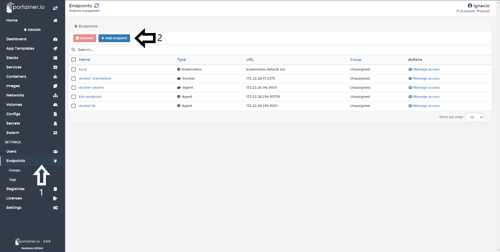
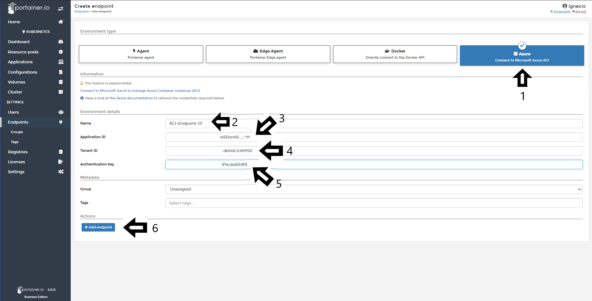

# Add an Azure Container Instance Endpoint

Portainer Business allows you to deploy and manage apps in Azure Container Instances quickly and easily and like no other tool. There is no need to type commands via CLI or go to the Azure Portal to manage your containers; Portainer does it all. Simply deploy Portainer in an Azure container and manage it like any other node.

## Requirements

Before connecting to your Azure Subscription, you need to create an Azure AD Application. For more information see the [Microsoft Documentation](https://docs.microsoft.com/en-us/azure/active-directory/develop/howto-create-service-principal-portal).

## Adding an ACI Endpoint

To add an ACI Endpoint you will need the following information:

* Name: Choose a name to identify this endpoint.
* Application ID: This value is from the application you created in Azure.
* Tenant ID: You can get your tenant ID of Azure Subscription page
* Authentication ID: This value is from the process of Application creation in Azure.

Once you have these values, you can start to add an ACI Endpoint to Azure. 

1. Go to <b>Endpoints</b> 2. Click <b>Add Endpoints</b>

3. Select <b>Azure</b> 4. Complete <b>Application</b> and <b>Azure Subscription</b> 5. Click <b>Add Endpoint</b>

Is everything works as expected, you will the following pop up

## :material-note-text: Notes

[Contribute to these docs](https://github.com/portainer/portainer-docs/blob/master/contributing.md){target=_blank}