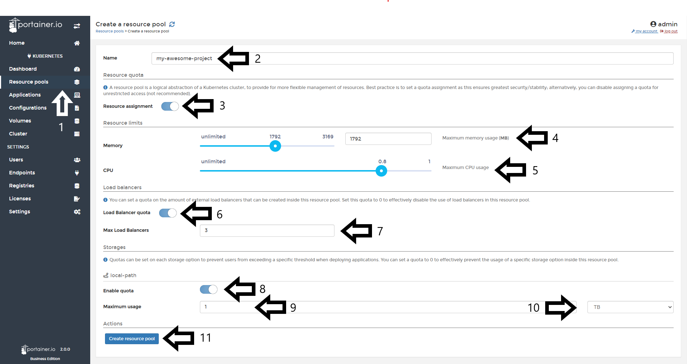

# Create a Resource Pool

The Resource Pools are helpful when multiple teams are using the same cluster and there is an potential collision, you can prevent this by using a virtual wall between multiple clusters. In this help article, you will learn how to create a Resource Pool (Namespace) using Portainer.

## Creating a Resouce Pool

Go to <b>Resouce Pools</b> and then click <b>Add resource pool</b>.

In the next screen, you need to define a few things:

### Name

Name your Resource Pool.

### Resource Assignment

 A resource pool is a logical abstraction of a Kubernetes cluster, to provide for more flexible management of resources. The best practice is to set a quota assignment as this ensures the greatest security/stability; alternatively, you can disable assigning a quota for unrestricted access (not recommended).

Here you can define resource limits:

* Memory
* CPU

<b>Note</b>: To Enable Resource Quota, you need to enable from the [settings of the cluster](/v2.0-be/settings/overcommit.md).

### Load balancers

 You can set a quota on the amount of external load balancers that can be created inside this resource pool. Set this quota to 0 to effectively disable the use of load balancers in this resource pool.

To enable a Load Balancer quota for this resource pool, enable the toggle <b>Load Balancer quota</b> and set the <b>Max Load Balancers</b>.

<b>Note</b>: To Enable Load Balancer Quota, you need to enable from the [settings of the cluster](/v2.0-be/settings/lb.md).

### Storages

 Quotas can be set on each storage option to prevent users from exceeding a specific threshold when deploying applications. You can set a quota to 0 to effectively prevent the usage of a specific storage option inside this resource pool.

To enable Storage Quota for this resource pool, enable the toogle <b>Enable quota</b>, set the <b>Maximum Usage</b> and the unit of storage (MB, GB, TB).

When everything is set, click <b>Create resource pool</b>.

If everything works as expected, you will see a pop up confirming the creation of this resource pool.

## Notes

[Contribute to these docs](https://github.com/portainer/portainer-docs/blob/master/contributing.md).