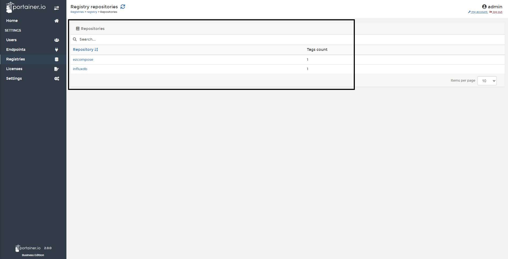
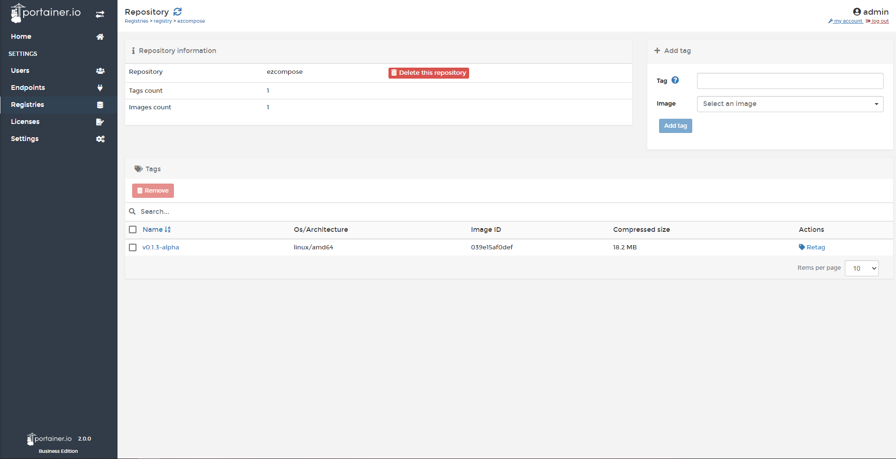

# Browse a Registry

Portainer Business Edition comes with a Registry Manager feature enabling simple operational management of your docker registries and their content, such as browsing the registries, exploring repositories and images, manipulating the tags that are attached to repositories and images, adding new tags, and deleting existing tags. 

In this help article, you will see how to browse a registry

## Browsing a Registry

To browse a registry go to <b>Registries</b> and select <b>browse</b> on the desired registry.

On the next screen, you will see the repositories and Tags count. 

If you enter to any repository, you can see a complete picture of the repository. You will find the following information:

* Name of the repository
* Tags count
* Images count
* Names of the images
* OS/Architecture
* Image ID
* Compressed size

If you click a tag, you will see relevant data, for example:

* ID: Identifier of the Tag.
* Parent: ID of the parent tag.
* Created: Date and time that was created.
* Build: Information about the docker version and OS used to build the image.
* Author

In the section DockerFile details, you will find information about the software (and the version) installed in that image.

You will also see the Image Layers to understand how the image was built.

# Notes

[Contribute to these docs](https://github.com/portainer/portainer-docs/blob/master/contributing.md){target=_blank}