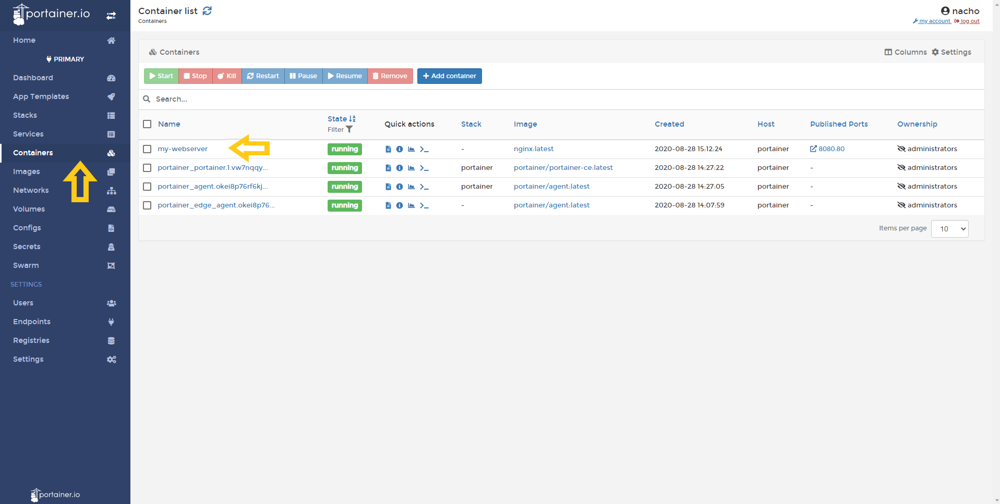
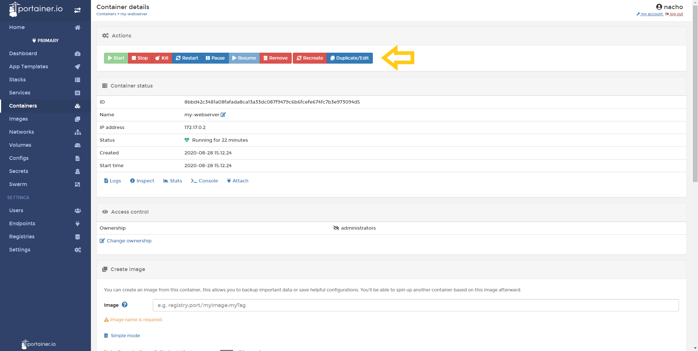
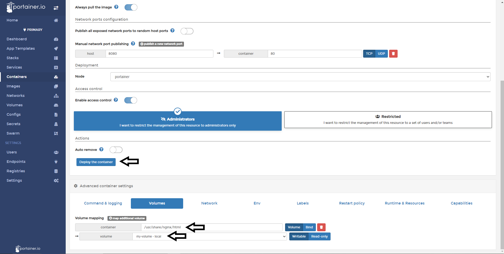
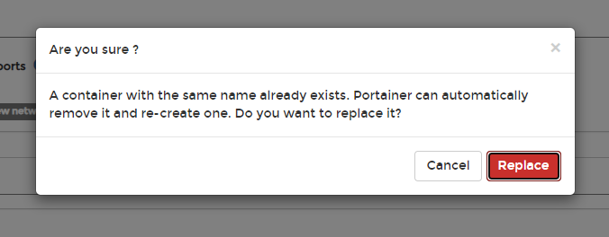
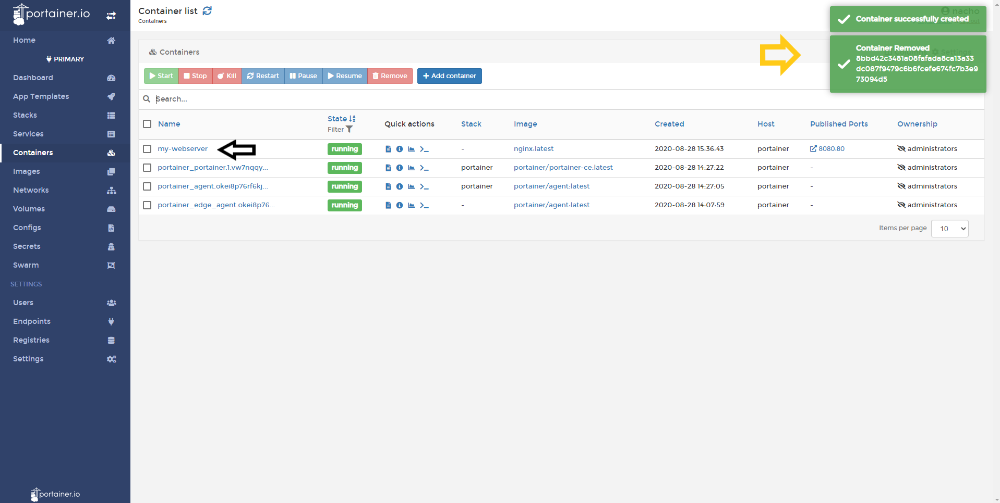
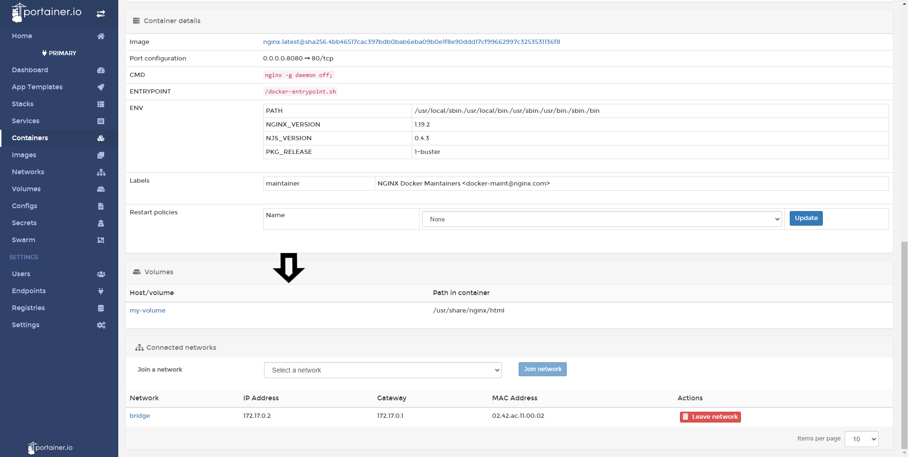

# Attach an existing Volume to a Container

Portainer can attach a new volume to a running container.
<b>Be advised that this operation destroys the running container and starts a new one with the volume attached. Backup your data before doing this.</b>

## Attaching a volume

Go to <b>Containers</b> and select the <b>container</b> that you want to attach a volume to.

Click <b>Duplicate/Edit.</b>

Scroll down to see the options for this container. Select <b>Volumes</b> and click <b>Map an Additional Volume.</b>

Next, type the path in the container, in the example below, for an NGINX container, the path to persist is "/usr/share/nginx/html". We also need to specify the volume created.

Finally, click <b>Deploy The Container</b>. You will receive the following warning:

If successful you will see the confirmation pop up at the top right of screen.

To confirm the configuration of your container, select it and scroll to the volume configuration, you should see a similar screen to the below:

## Notes

[Contribute to these docs](https://github.com/portainer/portainer-docs/blob/master/contributing.md).